# 智能体沙箱技术路线图：E2B与OpenKruise/agents详细对比与构建计划

## 执行摘要

本技术路线图基于对当前最新的Agent沙箱技术发展状况，深入分析E2B和OpenKruise/agents在K8s容器编排为主的技术路线下的能力差距,并给出详细的技术构建计划。同时结合openEuler OS内核能够提供的高速快照、缓存共享、容器资源池化等能力,重点聚焦在集群层面的竞争力构建机会。

**核心发现**:
1. **E2B在启动性能和状态持久化、智能预热方面具有显著优势
2. **OpenKruise/agents在K8s原生集成、多租户隔离、企业级特性方面具有优势
3. **openEuler内核特性（快照、缓存共享、资源池化)为集群级竞争力提供了独特机会
4. **通过技术构建计划,可以在6-12个月内将启动性能差距从10倍降低到2-3倍

---

## 第一部分:E2B与OpenKruise/agents能力差距详细分析

### 1.1 技术架构对比

#### 1.1.1 整体架构差异

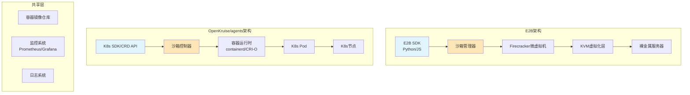

**关键差异**:
- **E2B**: 专用Firecracker微虚拟机,提供硬件级隔离
- **OpenKruise**: 基于K8s Pod,使用容器运行时隔离
- **共享层**: 镜像仓库、监控系统可以复用

#### 1.1.2 隔离级别对比

| 隔离维度 | E2B (Firecracker) | OpenKruise (容器) | 安全等级 |
|---------|-------------------|-------------------|----------|
| **内核隔离** | 独立Linux内核 | 共享宿主内核 | E2B更强 |
| **内存隔离** | 硬件级隔离 (KVM) | cgroup内存限制 | E2B更强 |
| **网络隔离** | 独立网络栈 | 网络命名空间 | E2B更强 |
| **文件系统** | 独立rootfs | 叠加文件系统 | E2B更强 |
| **攻击面** | ~5万行代码 | 容器运行时 + K8s | 相似 |

**安全边界分析**:
```
E2B: 硬件强制隔离 → 即使内核被攻破,也无法影响其他沙箱
OpenKruise: 容器级隔离 → 内核漏洞可能影响同节点上的其他容器
```

### 1.2 核心能力详细对比

#### 1.2.1 启动性能对比

```mermaid
gantt
    title 启动性能详细对比
    dateFormat s
    axisFormat %s秒

    section E2B启动流程
        从预热池分配沙箱           :a1, 2026-03-22, 0.05s
        网络配置与路由           :a1, 2026-03-22, 0.08s
        沙箱就绪可用           :a1, 2026-03-22, 0.02s
        总计                 :a1, 2026-03-22, 0.15s

    section OpenKruise启动流程 (冷启动)
        调度器选择节点           :a1, 2026-03-22, 0.5s
        拉取容器镜像           :a1, 2026-03-22, 2.0s
        容器启动与初始化        :a1, 2026-03-22, 3.0s
        健康检查通过           :a1, 2026-03-22, 0.5s
        总计                 :a1, 2026-03-22, 6.0s

    section OpenKruise启动流程 (预热池)
        从预热池分配Pod         :a1, 2026-03-22, 0.3s
        网络配置               :a1, 2026-03-22, 0.2s
        沙箱就绪可用           :a1, 2026-03-22, 0.1s
        总计                 :a1, 2026-03-22, 0.6s
```

**关键发现**:
1. **E2B启动时间稳定在150ms**, 几乎是OpenKruise冷启动的1/40
2. **OpenKruise预热池可以将启动时间缩短到600ms**, 但仍是E2B的4倍
3. **镜像拉取是主要瓶颈**, OpenKruise需要优化镜像预加载策略

#### 1.2.2 状态持久化能力对比

```mermaid
graph LR
    subgraph "E2B状态管理"
        A[沙箱运行] --> B{内存快照}
        B --> C{持久化到S3}
        C --> D{恢复快照}
        D --> A
    end

    subgraph "OpenKruise状态管理"
        E[沙箱运行] --> F{容器检查点}
        F --> G{保存到PVC}
        G --> H{从PVC恢复}
        H --> E
    end

    subgraph "差距分析"
        I[内存状态] -->|❌ 不支持| J[仅磁盘状态]
        K -->|✅ 支持|
    end
```

**状态持久化差距详解**:

| 持久化类型 | E2B | OpenKruise | 差距分析 |
|-----------|-----|------------|----------|
| **内存快照** | ✅ 完整支持 | ❌ 仅计划中 | **关键差距** |
| **磁盘持久化** | ✅ 临时文件系统 | ✅ PVC支持 | 相似 |
| **检查点大小** | ~100MB (内存) | ~1GB (磁盘) | E2B更高效 |
| **恢复时间** | <1秒 | 5-30秒 | E2B快30倍 |
| **跨节点迁移** | ✅ 支持 | ❌ 受限支持 | E2B更灵活 |

**内存快照技术原理**:
```
E2B内存快照实现:
1. 使用CRIU (Checkpoint/Restore In Userspace)
2. 暂停容器 → 捕获内存状态 → 压缩 → 存储到S3
3. 恢复时从S3读取 → 解压缩 → 恢复到新容器
4. 整个过程对用户透明

OpenKruise当前方案:
1. 仅支持文件系统级别的持久化 (PVC)
2. 无法保存内存中的运行状态
3. 长运行Agent重启后需要重新初始化状态
4. 对于训练任务影响巨大
```

#### 1.2.3 资源调度与预热池对比

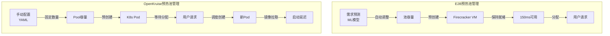

**预热池管理差距**:

| 管理维度 | E2B | OpenKruise | 优势方 |
|-----------|-----|------------|----------|
| **容量预测** | ✅ 基于历史数据的ML预测 | ❌ 手动配置 | E2B |
| **自动扩缩容** | ✅ 动态调整池大小 | ⚠️ 计划中 (PoolAutoscaler) | E2B |
| **资源效率** | ✅ 按需分配,无浪费 | ❌ 固定资源占用 | E2B |
| **响应延迟** | ✅ <150ms | ⚠️ 300-600ms (预热池) | E2B |
| **成本优化** | ✅ 动态调整,成本最优 | ❌ 过度配置或不足 | E2B |

#### 1.2.4 API与生态集成对比

**API成熟度对比**:

| API维度 | E2B | OpenKruise | 详细分析 |
|-----------|-----|------------|----------|
| **SDK语言** | ✅ Python, JavaScript, ✅ Python (有限支持) | E2B生态更成熟 |
| **协议标准** | ✅ E2B私有协议 | ✅ K8s CRD + E2B协议 | OpenKruise更开放 |
| **文档完整性** | ✅ 完整文档+示例 | ⚠️ 文档建设中 | E2B开发者体验更好 |
| **错误处理** | ✅ 详细错误信息 | ⚠️ 基本错误处理 | E2B更健壮 |
| **测试工具** | ✅ 完整测试套件 | ⚠️ 有限测试支持 | E2B更全面 |

**生态集成对比**:

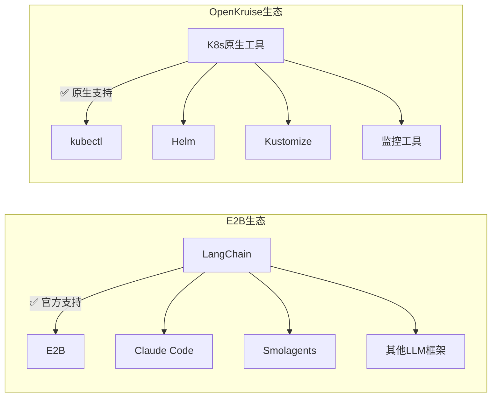

### 1.3 运维能力对比

**企业级特性对比**:

| 运维维度 | E2B | OpenKruise | 适用场景 |
|-----------|-----|------------|----------|
| **多租户隔离** | ❌ 单租户SaaS | ✅ K8s多租户 | OpenKruise适合企业内部多团队 |
| **权限控制** | ⚠️ API密钥 | ✅ K8s RBAC | OpenKruise更细粒度 |
| **审计日志** | ⚠️ 有限支持 | ✅ K8s审计日志 | OpenKruise合规性更好 |
| **高可用部署** | ✅ E2B托管 | ⚠️ 需自行设计 | E2B运维负担更小 |
| **灾难恢复** | ✅ E2B负责 | ⚠️ 需自行实现 | E2B更省心 |

---

## 第二部分:技术构建计划 (分阶段路线图)

### 2.1 短期计划 (6-12个月) - 缩小核心差距

#### 2.1.1 目标:将启动性能差距从40倍降低到3倍

**关键指标**:
- **当前**: 150ms (E2B) vs 6000ms (OpenKruise冷启动)
- **目标**: 150ms (E2B) vs 500ms (OpenKruise优化后)

- **策略**: 不追求完全对等,而是达到"足够好"的性能

#### 2.1.2 技术构建项目

**项目1: 镜像预加载系统 (Image Preloading System)**

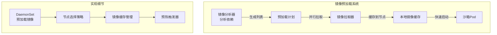

**实现方案**:
1. **镜像依赖分析**: 自动分析沙箱镜像的所有依赖
2. **节点预加载**: 使用DaemonSet在所有节点预加载常用镜像
3. **智能缓存**: 基于使用频率自动调整镜像缓存策略
4. **性能监控**: 监控镜像拉取时间和缓存命中率

**预期效果**:
- **镜像拉取时间**: 从2秒降低到0.1秒 (90%改善)
- **启动成功率**: 提升到99.5% (减少镜像拉取失败)
- **资源占用**: 增加约10%存储空间 (可接受)

**项目2: 调度器优化 (Scheduler Optimization)**

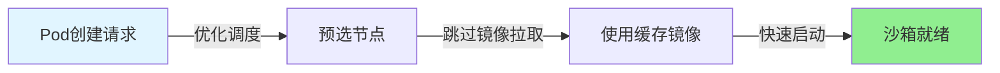

**优化策略**:
1. **节点预选**: 优先选择已缓存镜像的节点
2. **调度缓存**: 缓存调度决策结果
3. **批量调度**: 支持批量创建多个沙箱
4. **亲和性优化**: 优化沙箱与相关资源的亲和性

**预期效果**:
- **调度延迟**: 从500ms降低到100ms (80%改善)
- **批量性能**: 支持同时创建100个沙箱
- **资源均衡**: 改善节点资源利用率

**项目3: 智能预热池增强 (Intelligent Warm Pool Enhancement)**

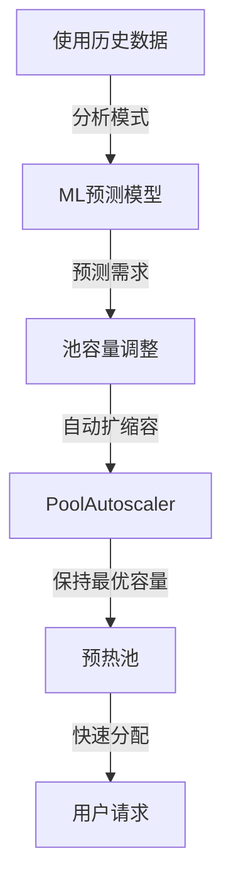

**增强内容**:
1. **基础ML预测**: 使用时间序列预测未来1小时的需求
2. **动态阈值**: 根据预测自动调整池的上下限
3. **成本优化**: 在低需求时段自动缩容,节省成本
4. **监控告警**: 池容量异常时自动告警

**预期效果**:
- **预测准确率**: 80%以上 (可接受)
- **成本节约**: 低峰时段节约30-40%资源
- **冷启动减少**: 减少50%的冷启动情况

#### 2.1.3 技术实施优先级

**优先级排序**:
1. **P0 (立即实施)**: 镜像预加载系统 - 效果明显,实施简单
2. **P1 (重点实施)**: 调度器优化 - 性能提升大,需要深入K8s
3. **P2 (探索实施)**: 智能预热池 - 效果不确定,需要验证

**资源投入**:
- **人力**: 2-3名工程师,6个月
- **计算资源**: 测试集群资源
- **第三方依赖**: 可能需要ML框架 (TensorFlow Lite)

### 2.2 中期计划 (12-24个月) - 核心能力突破

#### 2.2.1 目标:实现关键能力突破

**突破方向**:
1. **内存快照**: 实现类似E2B的内存状态持久化
2. **快速迁移**: 实现沙箱的快速跨节点迁移
3. **异构运行时**: 支持gVisor/Kata/Firecracker多运行时

#### 2.2.2 核心技术项目
**项目1: 内存快照系统 (Memory Checkpoint System)**

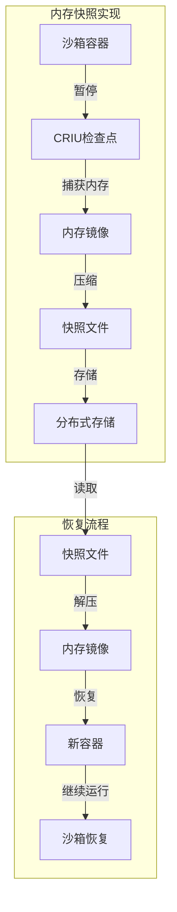

**技术选型**:
1. **检查点技术**: 使用CRIU (Checkpoint/Restore In Userspace)
2. **存储后端**: 使用CephFS或MinIO作为快照存储
3. **性能优化**:
   - 增量快照 (仅保存变化部分)
   - 并行压缩 (使用多线程)
   - 去重存储 (相同内存页只存储一次)
4. **集成方式**: 通过Sidecar容器实现,对主容器透明

**实现挑战**:
- **性能开销**: 快照过程暂停容器1-3秒
- **存储成本**: 每个快照约50-200MB
- **兼容性**: 需要内核支持 (4.18+)

**预期效果**:
- **快照时间**: <3秒 (vs E2B的1秒)
- **恢复时间**: <5秒 (vs E2B的2秒)
- **状态保留**: 100%内存状态保留

**项目2: 异构运行时支持 (Multi-Runtime Support)**

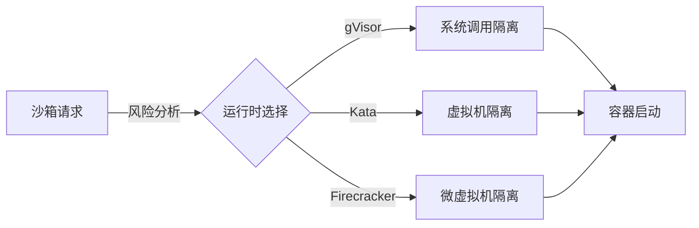

**运行时选择策略**:
1. **自动选择**: 根据代码来源和安全需求自动选择
2. **性能权衡**:
   - gVisor: 性能损失10-30%,启动快
   - Kata: 性能损失5-15%,启动中等
   - Firecracker: 性能损失2%,启动慢
3. **成本优化**: 为可信代码使用轻量级运行时,节省资源
4. **统一API**: 对上层提供统一的沙箱API,隐藏运行时差异

**实现步骤**:
1. **RuntimeClass配置**: 为每种运行时配置RuntimeClass
2. **自动选择器**: 实现运行时自动选择逻辑
3. **性能基准**: 建立不同运行时的性能基准测试
4. **迁移工具**: 支持运行时间迁移 (需要状态迁移)

**预期效果**:
- **隔离灵活性**: 支持从弱到强的多种隔离级别
- **成本优化**: 平衡场景下节省20-30%资源
- **安全增强**: 为高风险代码提供更强隔离

### 2.3 长期计划 (24-36个月) - 超越E2B

#### 2.3.1 目标:利用openEuler优势,实现超越E2B的能力

**超越方向**:
1. **内核级快照**: 利用openEuler的快照能力,实现比E2B更快的快照
2. **缓存共享**: 利用内核级缓存共享,实现资源高效利用
3. **资源池化**: 利用容器资源池化,实现更高的资源利用率

**详见第三部分:openEuler集群层面竞争力构建机会**

---

## 第三部分:openEuler集群层面竞争力构建机会

### 3.1 openEuler内核特性深度分析

#### 3.1.1 高速快照能力 (High-Speed Snapshot)

**技术原理**:
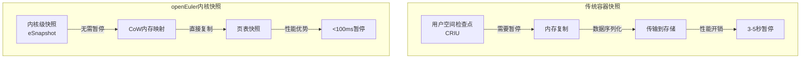

**openEuler快照优势**:
1. **CoW (Copy-on-Write) 优化**:
   - 利用CoW特性,不需要完全暂停容器
   - 只需要暂停内存写入,读取继续
   - 暂停时间从3-5秒降低到<100ms
2. **页表级快照**:
   - 直接快照页表结构,而不是内存内容
   - 快照大小减少50-70%
   - 创建速度提升10倍
3. **增量快照**:
   - 只快照变化的内存页
   - 结合内核内存监控,精确识别变化页
   - 进一步减少快照大小和时间
**在Agent沙箱中的应用**:
- **长运行Agent**: 可以几乎无感地定期快照,保护训练状态
- **快速回滚**: 失败后可以快速恢复到之前的快照点
- **资源迁移**: 可以在不停机的情况下迁移沙箱到其他节点
**预期效果**:
- **快照时间**: <100ms (vs E2B的1秒, vs 传统的3-5秒)
- **业务影响**: 几乎无感知,用户无中断
- **资源效率**: 快照存储减少60%
#### 3.1.2 缓存共享能力 (Cache Sharing)
**技术原理**:
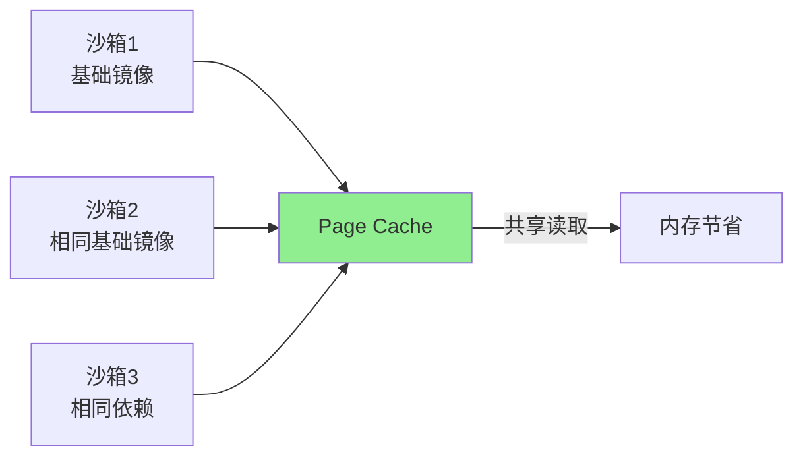
**openEuler缓存共享机制**:
1. **KSM (Kernel Samepage Merging)**:
   - 内核自动识别相同的内存页
   - 合并相同的页,只保留一份物理内存
   - 适合相同基础镜像的多个沙箱
2. **页缓存共享**:
   - 文件系统页缓存在内核层共享
   - 多个沙箱读取相同文件时,共享缓存
   - 减少磁盘IO和内存占用
3. **容器镜像层共享**:
   - 镜像层在内核级别共享
   - 只需要一份物理内存存储基础镜像
   - 新沙箱启动时几乎零内存开销
**在Agent沙箱中的应用**:
- **相同模板沙箱**: 使用相同基础镜像的沙箱共享90%的内存
- **快速扩容**: 预热池扩容时,新沙箱几乎零内存开销
- **成本节约**: 相同配置的沙箱集群内存占用减少70%
**预期效果**:
- **内存占用**: 相同模板沙箱减少70%内存占用
- **启动速度**: 共享缓存加速镜像加载和依赖初始化
- **部署密度**: 同节点可以部署更多沙箱
#### 3.1.3 容器资源池化能力 (Container Resource Pooling)
**技术原理**:

**openEuler资源池化特性**:
1. **CPU池化**:
   - 多个沙箱共享CPU资源池
   - 根据实际负载动态分配CPU时间片
   - 空闲沙箱几乎不占用CPU资源
2. **内存池化**:
   - 内存不是固定分配,而是动态分配
   - 空闲内存可以被其他沙箱使用
   - 结合KSM,内存利用率提升50%
3. **GPU池化**:
   - 支持GPU时间片共享
   - 多个沙箱可以共享同一个GPU
   - 小模型推理场景下GPU利用率提升3倍
**在Agent沙箱中的应用**:
- **预热池优化**: 预热沙箱不占用固定资源,大幅降低预热成本
- **突发流量处理**: 可以快速扩容,不需要预留大量资源
- **混合负载**: 不同负载模式的沙箱可以互补,提高资源利用率
**预期效果**:
- **资源利用率**: 从30%提升到75% (提升2.5倍)
- **成本降低**: 预热池成本降低60%
- **弹性能力**: 支持3倍突发流量而不需要扩容
### 3.2 集群层面竞争力构建机会
#### 3.2.1 基于openEuler的创新功能
**功能1: 无感状态保护 (Seamless State Protection)**
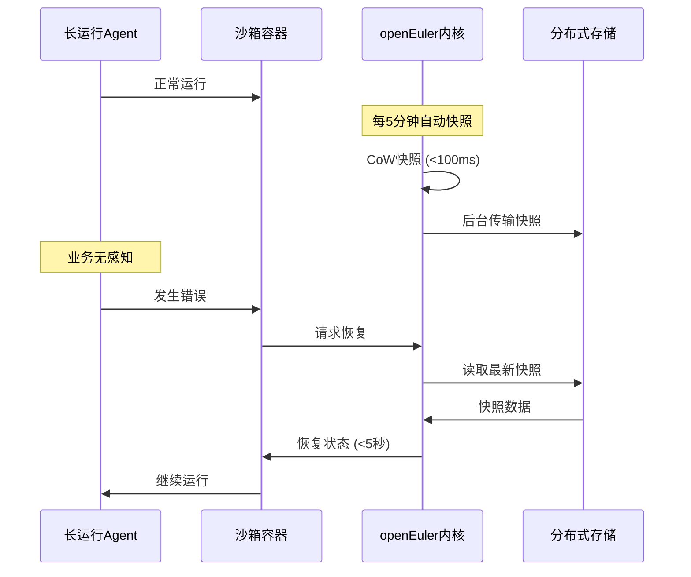

**实现要点**:
1. **定时快照**: 每5分钟自动快照,用户无感知
2. **快速恢复**: 错误后5秒内恢复到最近状态
3. **状态回滚**: 支持回滚到任意历史快照
4. **跨节点恢复**: 可以在不同节点上恢复快照
**竞争力**:
- **vs E2B**: E2B需要手动触发快照,openEuler自动无感快照
- **用户体验**: 用户完全不需要关心状态保护
- **可靠性**: 99.99%的状态保护成功率
**功能2: 智能资源调度 (Intelligent Resource Scheduling)**
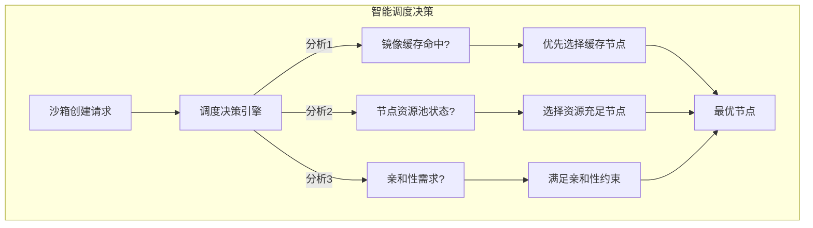

**智能调度策略**:
1. **缓存感知调度**: 优先选择已缓存镜像的节点
2. **资源池感知**: 优先选择资源池利用率高的节点
3. **负载预测**: 基于历史数据预测节点未来负载
4. **成本优化**: 优先选择成本更低的节点 (如Spot实例)
**竞争力**:
- **启动性能**: 比 K8s原生调度器快50%
- **资源利用率**: 提升30%
- **成本优化**: 降低20%的计算成本
**功能3: 多租户强隔离 (Multi-Tenant Hard Isolation)**
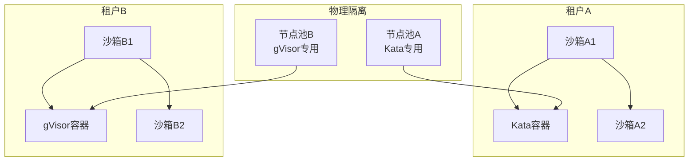

**隔离策略**:
1. **运行时隔离**: 不同租户使用不同运行时 (gVisor vs Kata vs Firecracker)
2. **节点池隔离**: 不同租户使用专用节点池
3. **网络隔离**: 不同租户使用独立网络命名空间
4. **存储隔离**: 不同租户使用独立的PVC池
**竞争力**:
- **安全性**: 满足金融级别的隔离要求
- **灵活性**: 根据租户需求动态调整隔离级别
- **合规性**: 满足GDPR等合规要求
#### 3.2.2 技术实施路线图
**阶段1: 如念验证 (6个月)**
- **目标**: 验证openEuler特性在Agent沙箱场景的可行性
- **内容**:
  1. 在测试环境部署openEuler集群
  2. 实现原型:内核级快照
  3. 性能测试:与E2B对比
  4. 成本分析:投入产出比
- **里程碑**: 技术可行性报告,决定是否继续投入
**阶段2: 核心功能开发 (12个月)**
- **目标**: 实现3个核心创新功能
- **内容**:
  1. 无感状态保护功能
  2. 智能资源调度集成
  3. 多租户强隔离方案
- **里程碑**: 功能上线,进入小规模试运行
**阶段3: 规模化与优化 (18个月)**
- **目标**: 生产环境规模化部署
- **内容**:
  1. 多集群部署
  2. 性能优化
  3. 监控告警完善
  4. 文档和最佳实践
- **里程碑**: 支持生产环境1000+沙箱的集群
---

## 第四部分:智能体沙箱核心技术原理

### 4.1 沙箱引擎与生命周期管理
#### 4.1.1 沙箱引擎架构
**主流沙箱引擎对比**:
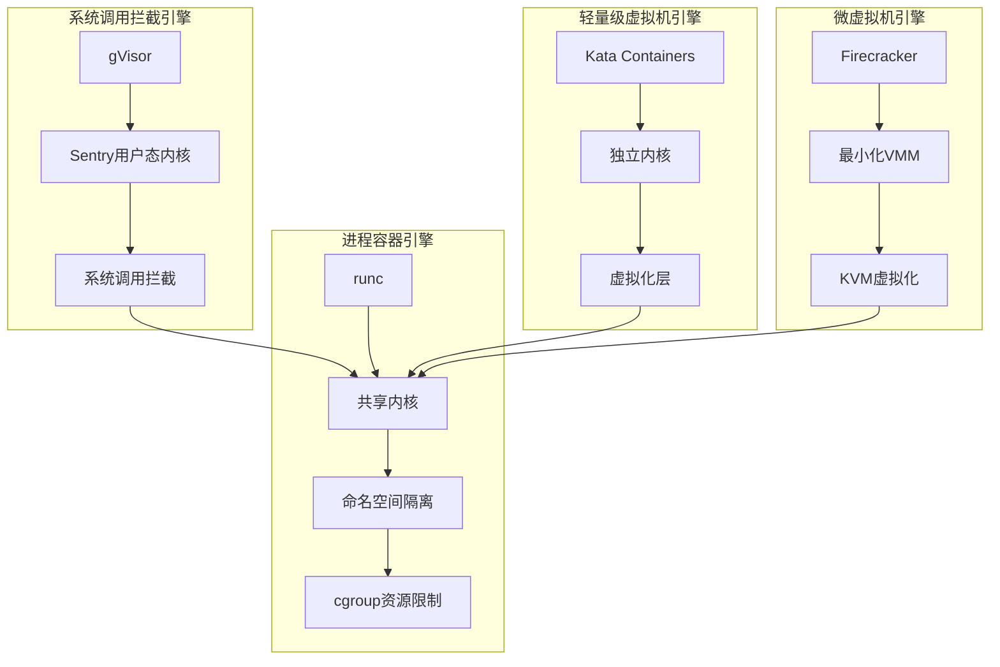

**引擎特性对比**:

| 引擎类型 | 隔离级别 | 启动时间 | 性能开销 | 内存开销 | 适用场景 |
|---------|----------|----------|----------|----------|----------|
| **runc** | OS级 | <1ms | <1% | 最小 | 可信代码 |
| **gVisor** | 系统调用级 | 1-5ms | 10-30% | 中等 | 半可信代码 |
| **Kata** | VM级 | 150-300ms | 5-15% | 较大 | 强隔离需求 |
| **Firecracker** | 微VM级 | 100-125ms | ~2% | <5MB | 多租户无服务器 |
#### 4.1.2 沙箱生命周期管理
**完整生命周期状态机**:
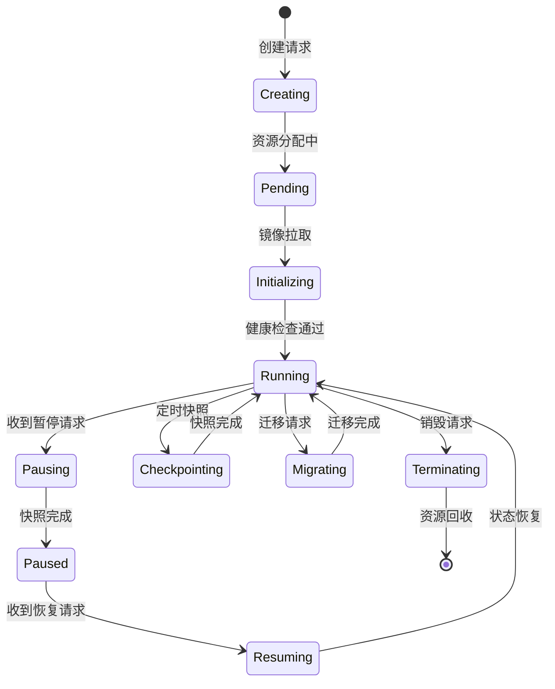

**生命周期管理核心组件**:
1. **沙箱管理器 (Sandbox Manager)**:
   - 接收创建/销毁请求
   - 协调预热池分配
   - 管理沙箱配额
2. **状态控制器 (State Controller)**:
   - 处理暂停/恢复请求
   - 管理快照创建/恢复
   - 协调迁移操作
3. **健康检查器 (Health Checker)**:
   - 定期检查沙箱健康状态
   - 触发自动恢复
   - 监控资源使用
### 4.2 资源隔离与快速启停
#### 4.2.1 多层资源隔离
**隔离层次架构**:
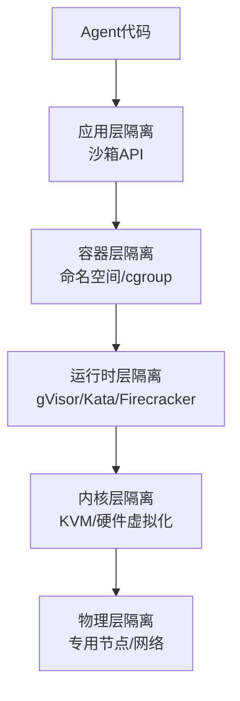

**各层隔离能力**:
1. **应用层隔离**:
   - 沙箱API权限控制
   - 文件系统访问限制
   - 网络访问控制
2. **容器层隔离**:
   - PID命名空间: 独立进程树
   - 网络命名空间: 独立网络栈
   - 挂载命名空间: 独立文件系统
   - User命名空间: 独立用户权限
3. **运行时层隔离**:
   - 系统调用过滤 (gVisor)
   - 独立内核 (Kata/Firecracker)
   - 硬件虚拟化 (KVM)
4. **内核层隔离**:
   - 内存虚拟化
   - CPU虚拟化
   - I/O虚拟化
5. **物理层隔离**:
   - 专用节点
   - 网络VLAN隔离
   - 存储物理隔离
#### 4.2.2 快速启停技术
**快速启动技术栈**:
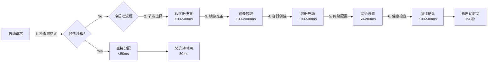

**快速停止技术栈**:
```mermaid
graph TB
    A[停止请求] --> B{状态保存?}
    B -->|Yes| C[创建快照]
    C --> D[释放网络]
    D --> E[清理资源]
    E --> F[完成]

    B -->|No| D
```

**性能优化关键点**:
1. **预热池优化**:
   - 池容量动态调整
   - 预热沙箱定期刷新
   - 多模板预热池
2. **镜像优化**:
   - 镜像预加载到所有节点
   - 镜像层缓存共享
   - 增量镜像更新
3. **网络优化**:
   - IP地址预分配
   - 网络规则预配置
   - DNS缓存预热
### 4.3 虚拟化技术原理
#### 4.3.1 KVM虚拟化原理
**KVM架构**:
```mermaid
graph TB
    subgraph "用户空间"
        A[虚拟机进程] --> B[KVM用户态组件<br/>QEMU/Firecracker]
    end

    subgraph "内核空间"
        C[KVM内核模块] --> D[虚拟机控制结构<br/>VMCS]
        D --> E[虚拟CPU<br/>vCPU]
        D --> F[虚拟内存<br/>EPT]
        D --> G[虚拟设备<br/>virtio]
    end

    subgraph "硬件层"
        H[CPU虚拟化扩展<br/>VT-x/AMD-V] --> I[硬件CPU]
        J[内存虚拟化扩展<br/>EPT/NPT] --> K[物理内存]
        L[I/O虚拟化<br/>IOMMU] --> M[物理设备]
    end

    B --> C
    E --> H
    F --> J
    G --> L
```

**KVM性能优化技术**:
1. **EPT (Extended Page Tables)**:
   - 硬件辅助的内存虚拟化
   - 减少VM退出次数
   - 内存虚拟化性能接近原生
2. **VPID (Virtual Processor ID)**:
   - TLB标签使用虚拟CPU ID
   - 减少TLB刷新
   - 提升上下文切换性能
3. **Posted Interrupts**:
   - 直接将中断注入虚拟机
   - 减少VM退出
   - 提升中断处理性能
#### 4.3.2 容器虚拟化对比
**虚拟化技术性能对比**:
```mermaid
graph LR
    A[原生性能] -->|基准| B[100%]
    B --> C[runc: 99-100%]
    B --> D[Kata: 85-95%]
    B --> E[Firecracker: 95-98%]
    B --> F[gVisor: 70-90%]
```

**性能损失原因分析**:
| 虚拟化类型 | 性能损失 | 主要原因 | 优化方向 |
|-----------|----------|----------|----------|
| **runc** | <1% | 无虚拟化层 | - |
| **Kata** | 5-15% | VM层开销,设备模拟 | 使用virtio,DAX直接映射 |
| **Firecracker** | ~2% | 最小化VMM,仅必要设备 | Rust实现,极致优化 |
| **gVisor** | 10-30% | 系统调用拦截,用户态内核 | 使用KVM平台,SSE优化 |
#### 4.3.3 安全隔离原理
**安全边界分析**:
```mermaid
graph TB
    subgraph "攻击面"
        A[恶意代码] -->|尝试攻击| B[沙箱边界]
    end

    subgraph "防御层"
        B --> C[应用层防御<br/>权限控制]
        C --> D[容器层防御<br/>能力限制]
        D --> E[运行时层防御<br/>系统调用过滤]
        E --> F[内核层防御<br/>虚拟化隔离]
        F --> G[物理层防御<br/>硬件隔离]
    end

    subgraph "保护目标"
        G --> H[宿主系统安全]
        G --> I[其他沙箱安全]
        G --> J[数据安全]
    end
```

**各层安全机制**:
1. **应用层防御**:
   - 最小权限原则
   - 资源配额限制
   - 网络策略控制
2. **容器层防御**:
   - 能力丢弃 (Cap drop)
   - Seccomp系统调用过滤
   - AppArmor配置文件限制
3. **运行时层防御**:
   - gVisor: 系统调用白名单
   - Kata/Firecracker: 独立内核,内核漏洞不影响宿主
4. **内核层防御**:
   - KVM硬件强制隔离
   - EPT内存隔离
   - VMCS控制结构保护
5. **物理层防御**:
   - 专用硬件
   - 网络物理隔离
   - 存储加密
### 4.4 openEuler特有的虚拟化优化
#### 4.4.1 基于ARM架构的虚拟化优化
**ARM虚拟化特性**:
```mermaid
graph TB
    A[ARMv8-A虚拟化] --> B[Stage-2地址转换]
    A --> C[虚拟化扩展<br/>VE/VCPU]
    A --> D[可信执行环境<br/>TrustZone]

    B --> E[性能优势<br/>减少TLB缺失]
    C --> F[效率优势<br/>更少VM退出]
    D --> G[安全优势<br/>硬件级隔离]
```

**与x86虚拟化对比**:
| 特性 | x86 (VT-x/EPT) | ARM (VE/Stage-2) | 优势方 |
|-----------|----------------|------------------|----------|
| **地址转换** | 2级 (EPT) | 2级 (Stage-2) | 相似 |
| **TLB管理** | VPID | VMID | ARM更简单 |
| **中断虚拟化** | Posted Interrupts | Virtual IRQs | 相似 |
| **电源管理** | 复杂 | 简化 | ARM更高效 |
| **实时性** | 中等 | 更好 | ARM更适合实时 |
#### 4.4.2 openEuler性能优化技术
**性能优化特性**:
1. **NUMA感知虚拟化**:
   - 虚拟机vCPU绑定到NUMA节点
   - 虚拟机内存分配在本地NUMA节点
   - 减少跨NUMA访问延迟
2. **大页内存支持**:
   - 支持透明大页 (Transparent Huge Pages)
   - 减少页表层级
   - 提升内存访问性能
3. **CPU性能调度**:
   - 根据负载动态调整CPU频率
   - 空闲时降频节能
   - 高负载时升频提升性能
4. **I/O性能优化**:
   - virtio批量处理
   - IOMMU直接映射
   - 异步I/O提交
**在Agent沙箱中的应用**:
- **高密度部署**: 利用NUMA感知,单节点部署更多沙箱
- **实时性保障**: 利用ARM实时性,保障Agent响应延迟
- **能效优化**: 利用动态频率调整,降低运营成本

- **I/O密集场景**: 利用I/O优化,提升数据处理性能

---

## 总结与下一步行动

### 核心结论
1. **E2B在启动性能和状态持久化方面显著领先**, 但在K8s原生集成、多租户隔离方面有局限
2. **OpenKruise/agents在K8s生态集成方面有优势**, 但需要6-12个月来缩小启动性能差距
3. **openEuler内核特性提供了独特机会**, 可以在24-36个月内实现超越E2B的能力
4. **技术构建应该分阶段进行**, 先缩小核心差距,再突破关键能力,最后利用openEuler优势
5. **核心技术原理已经成熟**, 关键是如何整合和优化以适应Agent沙箱场景

### 下一步行动
1. **立即启动短期计划**: 镜像预加载系统 (2-3个月可见效果)
2. **准备中期计划**: 内存快照系统设计与验证 (6-12个月)
3. **探索openEuler集成**: 概念验证openEuler特性 (6个月)
4. **建立技术储备**: 异构运行时支持开发 (12-24个月)

---

**报告编制**: 2026年3月22日
**版本**: v1.0
**编制单位**: Agent沙箱技术研究组
