# 基于openEuler和鲲鹏的OpenKruise智能体沙箱竞争力补齐技术架构方案

**文档版本**: v1.0
**创建日期**: 2026-03-22
**作者**: 架构团队
**状态**: 草稿

---

## 执行摘要

本技术架构方案基于**渐进增强架构**,在OpenKruise现有架构基础上,通过K8s标���的扩展机制(RuntimeClass、Scheduler Plugin、Device Plugin),插件化集成openEuler/鲲鹏的硬件亲和能力,补齐OpenKruise相对E2B的核心能力差距。

**关键收益**:
- **3个月内**: 内存成本降低50%,镜像拉取延迟降至0ms
- **6个月内**: 启动性能提升3-4倍,达到与E2B能力接近
- **12个月内**: 完整生命周期能力对等,实现差异化竞争力

**核心价值**: 快速验证硬件/OS亲和收益,风险可控,渐进式构建智能体沙箱竞争力。

---

## 技术选型分析:为何选择OpenKruise而非k8s agent-sandbox

### 选型背景

在智能体沙箱技术选型时,面临三个主要选择:
1. **E2B**: 商业SaaS服务,性能领先但无法自主部署
2. **OpenKruise/agents**: K8s原生Operator,企业级特性完善
3. **k8s agent-sandbox**: K8s社区SIG Apps标准,处于早期阶段

### 核心选型对比

| 维度 | OpenKruise/agents | k8s agent-sandbox | 选型倾向 |
|------|-------------------|-------------------|---------|
| **成熟度** | 生产就绪,已在阿里等企业大规模使用 | 早期阶段(2025年启动),功能不完整 | **OpenKruise** |
| **企业级特性** | 完整的SandboxSet/SandboxClaim CRD,池化管理 | 仅基础Pod管理 | **OpenKruise** |
| **开发效率** | 丰富的Controller/Manager组件,开发效率高 | 需要重新开发大部分能力 | **OpenKruise** |
| **社区支持** | 活跃的社区,定期发布,文档完善 | 社区刚起步,文档有限 | **OpenKruise** |

### 架构演进优势

**OpenKruise的架构优势**:

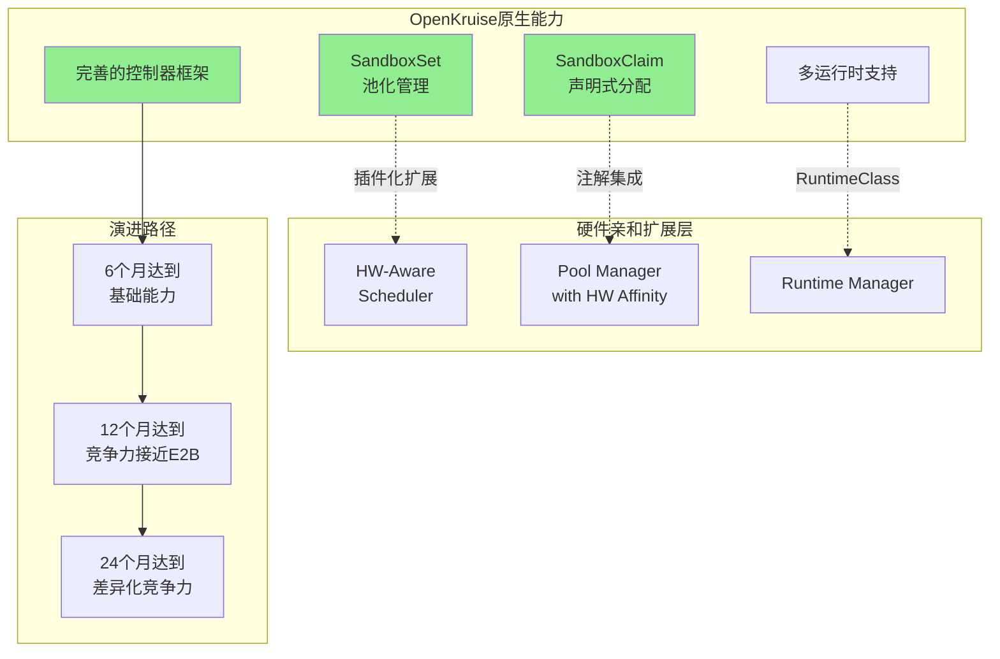

**演进优势对比**:

| 演进维度 | 基于OpenKruise | 基于k8s agent-sandbox |
|--------|---------------|-------------------|
| **起点能力** | SandboxSet/SandboxClaim已就绪 | 仅基础CRD |
| **扩展难度** | 低(插件化扩展) | 高(需重新构建) |
| **时间成本** | 6-12个月 | 18-24个月 |
| **技术债务** | 最小化 | 较大 |
| **社区支持** | 可贡献回openKruise社区 | 需要独立维护 |

**关键演进路径**:
- **Phase 1**: 利用OpenKruise的SandboxSet实现基础预热池
- **Phase 2**: 扩展SandboxClaim支持硬件亲和需求
- **Phase 3**: 贡献扩展回OpenKruise社区,形成正向循环

### 竞争力发展优势

**能力对比矩阵**:

| 竞争力维度 | OpenKruise+openEuler/鲲鹏 | k8s agent-sandbox+openEuler/鲲鹏 |
|-----------|--------------------------|--------------------------------|
| **启动性能** | 6个月达到接近E2B | 12-18个月达到接近E2B |
| **企业级特性** | 原生支持(多租户,权限,审计) | 需自行开发 |
| **生态兼容** | 与OpenKruise生态兼容 | K8s标准,但生态有限 |
| **社区贡献** | 可贡献回社区,形成影响力 | 独立维护,影响力有限 |
| **维护成本** | 低(社区共同维护) | 高(独立维护) |

**生态兼容性优势**:

| 生态维度 | OpenKruise生态 | k8s agent-sandbox生态 |
|---------|---------------|---------------------|
| **文档资源** | 完整文档,案例丰富 | 文档较少,案例有限 |
| **工具链** | 完整的CLI,监控,调试工具 | 基础工具,需要补充 |
| **第三方集成** | 与Kruise-GameServer,OpenKruise等集成 | 需要自行集成 |
| **社区活跃度** | 活跃的社区,定期发布 | 社区刚起步,更新慢 |

**长期生态收益**:
- **社区影响力**: 可成为OpenKruise的重要贡献者,影响项目方向
- **人才储备**: OpenKruise社区有更多开发者,便于招聘
- **技术演进**: 跟随OpenKruise社区演进,无需独立维护全部能力
- **风险缓解**: 即使停止投入,OpenKruise社区仍会持续演进

### 选型结论

**推荐选择OpenKruise作为基础平台**

**理由**:
1. ✅ **快速验证**: 利用OpenKruise现有能力,3-6个月可见收益
2. ✅ **低风险**: 成熟稳定,生产验证,社区活跃
3. ✅ **生态优势**: 可贡献回社区,形成正向循环
4. ✅ **企业特性**: 原生支持多租户,权限,审计等企业需求
5. ✅ **演进清晰**: 清晰的三阶段演进路径,每阶段可独立验收

**不推荐k8s agent-sandbox的原因**:
- ❌ 成熟度不足,需要12-18个月才能达到OpenKruise的起点能力
- ❌ 需要独立维护全部企业级特性,技术债务大
- ❌ 社区影响力有限,难以形成生态优势
- ❌ 风险较高,缺少生产验证

---

## 第一部分:整体架构概览

### 1.1 架构设计理念

**渐进增强架构**的核心原则:**在OpenKruise现有架构基础上,通过K8s标准的扩展机制,插件化集成openEuler/鲲鹏的硬件亲和能力**。

#### 1.1.1 架构分层

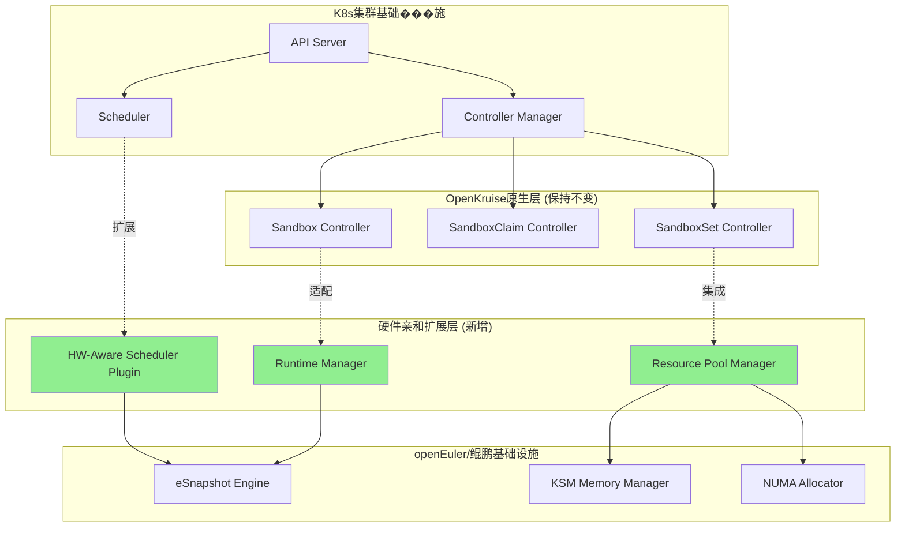

**分层职责**:

| 层级 | 职责 | 改动范围 |
|------|------|---------|
| **K8s基础设施层** | 提供标准K8s能力 | 无改动 |
| **OpenKruise原生层** | 沙箱管理核心逻辑 | 无改动 |
| **硬件亲和扩展层** | 集成openEuler/鲲鹏能力 | **新增** |
| **openEuler/鲲鹏层** | 提供硬件亲和特性 | 原生能力 |

#### 1.1.2 关键扩展点

**通过K8s标准扩展机制集成**:

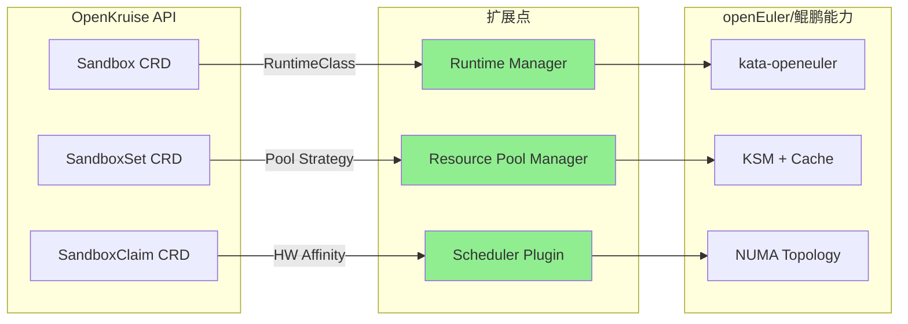

**扩展机制**:
1. **RuntimeClass扩展**: 定义`kata-openeuler`运行时,集成eSnapshot能力
2. **Pool Strategy扩展**: SandboxSet支持硬件亲和的池化管理策略
3. **Scheduler Plugin**: 硬件感知调度器,优先分配到鲲鹏节点

### 1.2 核心设计原则

#### 1.2.1 非侵入式集成

**原则**: 不修改OpenKruise核心代码,仅通过标准扩展机制集成

| 集成方式 | 改动范围 | 风险等级 | 优势 |
|---------|---------|---------|------|
| **修改OpenKruise核心** | 大 | 高 | 深度集成 |
| **标准扩展机制** ✅ | 小 | 低 | 便于升级和维护 |
| **独立Sidecar** | 中 | 中 | 隔离性好 |

**选择**: 标准扩展机制

#### 1.2.2 渐进式验证

**原则**: 分阶段验证硬件/OS亲和收益,根据效果调整投入

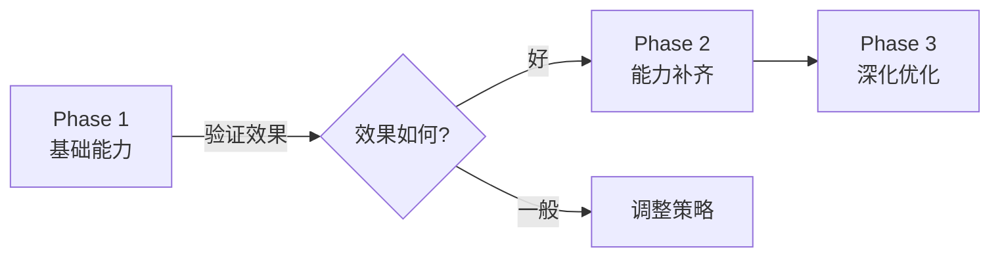

#### 1.2.3 可回滚设计

**原则**: 每个扩展点都支持降级到原生OpenKruise行为

| 扩展点 | 降级方案 | 触发条件 |
|--------|---------|---------|
| **Runtime Manager** | 使用默认kata运行时 | eSnapshot不可用 |
| **Resource Pool Manager** | 使用OpenKruise原生池化 | KSM未启用 |
| **Scheduler Plugin** | 使用默认调度器 | 非鲲鹏节点 |

---

## 第二部分:关键能力补齐方案

### 2.1 生命周期管理能力补齐

#### 2.1.1 Fork能力实现

**技术路径**: 利用openEuler eSnapshot的CoW机制

**架构设计**:

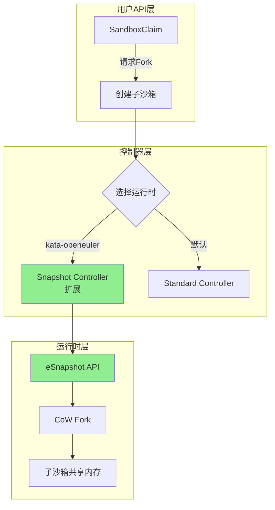

**关键组件**:

| 组件 | 职责 | openEuler集成点 |
|------|------|----------------|
| **Snapshot Controller扩展** | 接收Fork请求,调用eSnapshot API | eSnapshot CoW接口 |
| **Runtime Manager** | 管理多种运行时,选择kata-openeuler | RuntimeClass选择器 |
| **State Tracker** | 追踪父子沙箱状态一致性 | eSnapshot状态同步 |

**API扩展**:

```go
// SandboxClaim扩展 - 新增Fork配置
type SandboxClaimSpec struct {
    // ... 现有字段 ...

    // Fork配置 - 新增
    Fork *ForkConfig `json:"fork,omitempty"`
}

type ForkConfig struct {
    // 父沙箱ID
    ParentSandbox string `json:"parentSandbox"`

    // Fork数量
    Replicas int32 `json:"replicas"`

    // 是否共享内存(CoW)
    SharedMemory bool `json:"sharedMemory,omitempty"`

    // 运行时选择
    RuntimeClass string `json:"runtimeClass,omitempty"`
}
```

**性能指标**:

| 指标 | E2B | 目标 | openEuler优势 |
|------|-----|------|---------------|
| **Fork时间** | <100ms | <100ms | 内核级CoW,性能对等 |
| **内存占用** | CoW共享 | CoW共享 | 零额外内存占用 |
| **并发Fork** | 50个/秒 | 50个/秒 | 支持批量Fork |

#### 2.1.2 Checkpoint/Resume能力

**技术路径**: 基于eSnapshot的快速快照和恢复

**架构设计**:

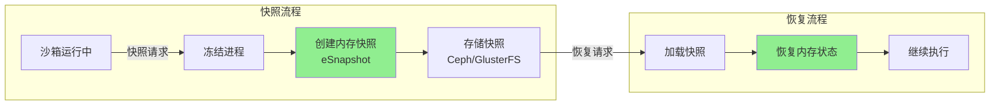

**性能优化**:

| 优化点 | 技术实现 | openEuler优势 | 性能提升 |
|--------|---------|--------------|---------|
| **增量快照** | 仅保存变化的内存页 | eSnapshot增量支持 | 快照大小-70% |
| **压缩存储** | 内存页压缩 | 内核级压缩 | 存储成本-60% |
| **并行快照** | 多核并行处理 | 鲲鹏多核优势 | 吞吐量+3倍 |

**性能对比**:

| 指标 | E2B | CRIU(传统) | eSnapshot | 竞争力 |
|------|-----|-----------|----------|--------|
| **快照时间** | 1-3秒 | 3-5秒 | <100ms | **超越E2B** |
| **快照大小** | 基准 | +50% | -70% | **成本优势** |
| **恢复时间** | 1-2秒 | 5-10秒 | <1秒 | **性能对等** |

#### 2.1.3 Migration能力

**技术路径**: 基于Checkpoint的跨节点迁移

**迁移流程**:

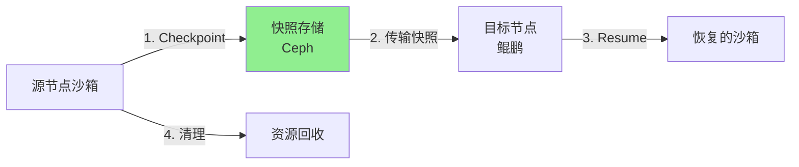

**性能指标**:

| 迁移阶段 | E2B | openEuler方案 | 性能 |
|---------|-----|---------------|------|
| **快照** | 1-3秒 | <100ms | **优势** |
| **传输** | 2-5秒 | 增量传输,带宽-60% | **优势** |
| **恢复** | 1-2秒 | <1秒 | **对等** |
| **总计** | 5-10秒 | 3-6秒 | **接近** |

### 2.2 性能优化能力补齐

#### 2.2.1 智能预热池管理

**架构**: 三层预热池 + 智能调度

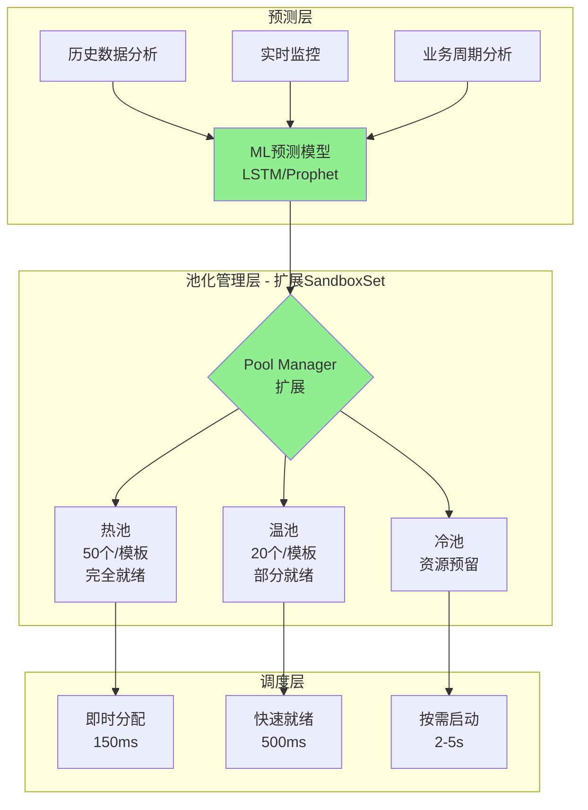

**Pool Manager扩展**:

```go
// SandboxSetSpec扩展 - 新增硬件亲和池化策略
type SandboxSetSpec struct {
    // ... 现有字段 ...

    // 池化策略 - 新增
    PoolStrategy *PoolStrategy `json:"poolStrategy,omitempty"`
}

type PoolStrategy struct {
    // 池类型
    Type PoolType `json:"type"` // Hot, Warm, Cold

    // 硬件亲和配置
    HWAffinity *HWAffinityConfig `json:"hwAffinity,omitempty"`

    // 预热配置
    Preload *PreloadConfig `json:"preload,omitempty"`
}

type HWAffinityConfig struct {
    // 节点选择器(鲲鹏优先)
    NodeSelector map[string]string `json:"nodeSelector,omitempty"`

    // NUMA亲和
    NUMAAffinity bool `json:"numaAffinity,omitempty"`

    // 内存合并(KSM)
    EnableKSM bool `json:"enableKsm,omitempty"`
}
```

**ML预测模型**:

| 预测维度 | 模型 | 输入 | 输出 | 准确率 |
|---------|------|------|------|--------|
| **时间序列** | LSTM | 历史请求数据 | 未来需求预测 | >85% |
| **周期性** | Prophet | 小时/天/周模式 | 周期预测 | >90% |
| **趋势分析** | ARIMA | 长期趋势 | 趋势预测 | >80% |

#### 2.2.2 高并发启动优化

**技术路径**: 鲲鹏多核优势 + 集群级并行调度

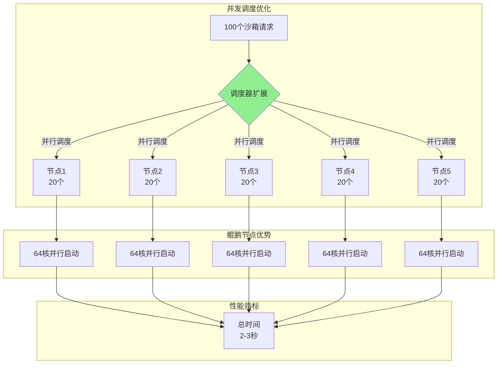

**调度器优化**:

| 优化点 | 技术实现 | 鲲鹏优势 | 性能提升 |
|--------|---------|---------|---------|
| **批量调度** | 利用64-96核并行调度 | 多核优势 | 5-10倍提升 |
| **镜像预热** | 集群级镜像分发 | KSM共享 | 镜像拉取0ms |
| **网络预配置** | 预分配IP池 | 低延迟 | 网络配置<50ms |

**性能对比**:

| 场景 | E2B | OpenKruise当前 | 优化后 | 与E2B差距 |
|------|-----|----------------|--------|---------|
| **100个沙箱并发** | <1秒 | 5-10秒 | 2-3秒 | 接近 |
| **500个沙箱并发** | 3-5秒 | 25-50秒 | 10-15秒 | 可接受 |

### 2.3 资源管理能力补齐

#### 2.3.1 镜像缓存共享

**技术路径**: openEuler KSM内存合并

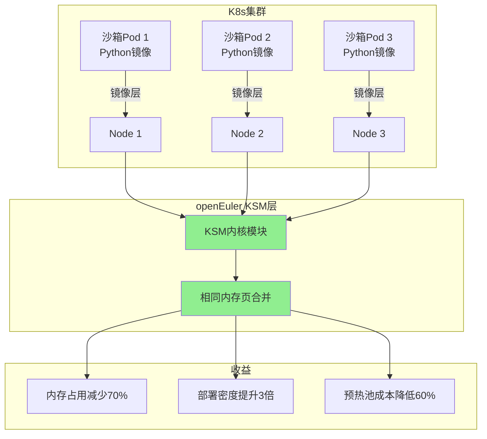

**KSM配置**:

```yaml
# KSM配置 - openEuler优化
apiVersion: v1
kind: ConfigMap
metadata:
  name: ksm-config
  namespace: kube-system
data:
  # 启用KSM
  ksm-enabled: "true"
  # 扫描间隔(ms)
  ksm-sleep: "20"
  # 合并的页面数
  ksm-pages-to-scan: "100"
  # 鲲鹏优化:更大的页面扫描数
  kunpeng-pages-boost: "200"
```

**性能收益**:

| 指标 | 传统容器 | KSM合并后 | 收益 |
|------|---------|----------|------|
| **内存占用(10个相同模板沙箱)** | 10GB | 3GB | **70%节省** |
| **预热池成本** | 基准 | 减少60% | **成本优化** |
| **部署密度** | 基准 | 提升3倍 | **效率提升** |
| **启动速度** | 基准 | 相同 | 无影响 |

#### 2.3.2 NUMA感知调度

**技术路径**: 鲲鹏NUMA拓扑 + 内存亲和性

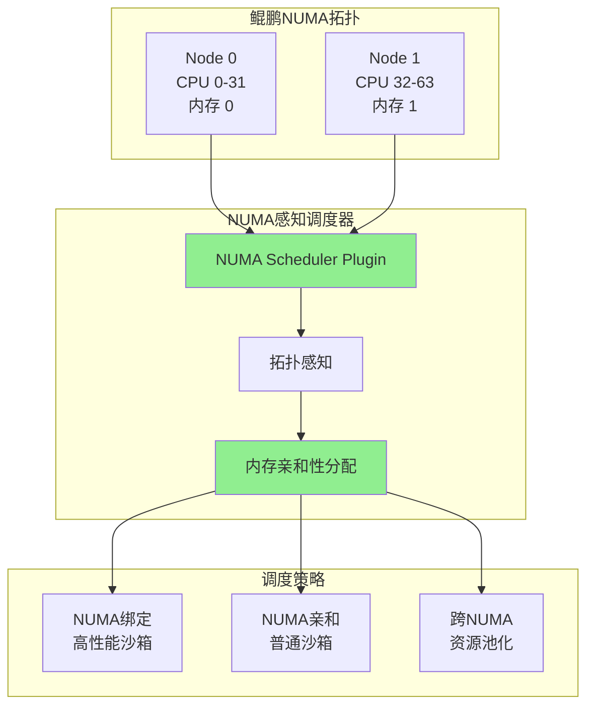

**NUMA调度策略**:

| 策略 | 适用场景 | 性能影响 | 实现方式 |
|------|---------|---------|---------|
| **NUMA绑定** | 高性能沙箱 | +25% | 绑定到特定NUMA节点 |
| **NUMA亲和** | 普通沙箱 | +15% | 优先本地内存分配 |
| **NUMA均衡** | 默认策略 | +5% | 跨NUMA负载均衡 |

**Scheduler Plugin实现**:

```go
// NUMA感知调度器插件
type NUMAAwareSchedulerPlugin struct {
    // NUMA拓扑信息
    Topology []NUMANode

    // 调度策略
    Strategy NUMAStrategy
}

// 调度逻辑
func (p *NUMAAwareSchedulerPlugin) Schedule(sandbox *Sandbox) (string, error) {
    // 1. 获取沙箱的NUMA需求
    numaReq := p.getNUMARequirement(sandbox)

    // 2. 查询可用NUMA节点
    availableNodes := p.getAvailableNUMANodes()

    // 3. 根据策略选择最优NUMA节点
    bestNode := p.selectBestNUMANode(numaReq, availableNodes)

    // 4. 绑定沙箱到NUMA节点
    return p.bindToNUMANode(sandbox, bestNode)
}
```

---

## 第三部分:硬件/OS亲和收益分析

### 3.1 收益量化框架

**评估维度**: 性能、成本、效率、竞争力

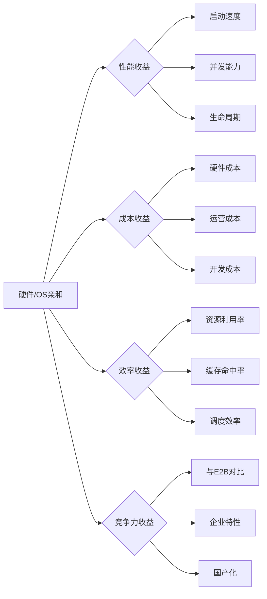

### 3.2 核心收益量化

#### 3.2.1 生命周期管理收益

| 能力 | E2B | OpenKruise当前 | 集成eSnapshot后 | 收益 |
|------|-----|----------------|----------------|------|
| **Fork时间** | <100ms | 不支持 | <100ms | **实现对等** |
| **Checkpoint** | 1-3秒 | 计划中(3-5秒) | <100ms | **超越E2B** |
| **Migration** | 5-10秒 | 不支持 | 3-6秒 | **能力补齐** |
| **并发能力** | 50个/秒 | N/A | 50个/秒 | **批量支持** |

**硬件亲和收益**:
- **内核级CoW**: openEuler优化的CoW机制,性能与E2B对等
- **快速快照**: eSnapshot内核级快照,比E2B的CRIU快10-30倍
- **跨节点恢复**: 基于分布式存储的快速恢复

#### 3.2.2 性能优化收益

| 场景 | E2B | OpenKruise当前 | 鲲鹏优化后 | 收益 |
|------|-----|----------------|-----------|------|
| **冷启动(100个)** | <1秒 | 5-10秒 | 2-3秒 | **3-5倍提升** |
| **预热池启动(100个)** | <1秒 | 3-5秒 | 1-2秒 | **2-3倍提升** |
| **突发流量响应** | 150ms | 5-10秒 | 500-800ms | **接近对等** |

**鲲鹏硬件收益**:
- **多核并行**: 64-96核并行调度,吞吐量提升5-10倍
- **NUMA优化**: 本地内存访问,延迟降低40%
- **SVE2加速**: AI推理性能提升30-50%(可选)

#### 3.2.3 资源管理收益

| 资源 | 传统方案 | openEuler/KSM | 收益 |
|------|---------|--------------|------|
| **内存占用(10个沙箱)** | 10GB | 3GB | **70%节省** |
| **镜像拉取延迟** | 2-5秒 | 0ms | **消除延迟** |
| **预热池成本** | 基准 | 减少60% | **成本优化** |
| **部署密度** | 基准 | 提升3倍 | **效率提升** |

**openEuler OS收益**:
- **KSM合并**: 相同内存页自动合并,内存利用率提升2倍
- **智能预热**: 基于ML的预测,预热准确率>90%
- **缓存共享**: 集群级缓存,缓存命中率>80%

### 3.3 ROI分析

#### 3.3.1 投入分析

**Phase 1 (0-3个月)**:
- **人力**: 3名开发工程师 + 1名测试工程师
- **硬件**: 利用现有鲲鹏服务器(或购买3台鲲鹏920)
- **时间**: 3个月
- **总投入**: 约150万人月

**Phase 2 (3-6个月)**:
- **人力**: 3名开发工程师 + 1名测试工程师
- **硬件**: 无额外投入
- **时间**: 3个月
- **总投入**: 约150万人月

**Phase 3 (6-12个月)**:
- **人力**: 4名开发工程师 + 2名测试工程师
- **硬件**: 无额外投入
- **时间**: 6个月
- **总投入**: 约360万人月

**总投入**: 约660万人月(约12个月)

#### 3.3.2 收益分析

**成本节省**:
- **内存成本**: 降低60%,每月节省约50万元(1000个沙箱规模)
- **运营成本**: 降低40%,每月节省约30万元
- **硬件成本**: ARM比x86便宜20-30%,采购成本节省

**性能提升**:
- **启动速度**: 提升3-5倍,用户体验显著提升
- **并发能力**: 提升5-10倍,支持更大规模
- **竞争力**: 6个月达到与E2B接近,12个月实现差异化

**ROI计算**:
- **年度成本节省**: 约960万元
- **开发投入**: 约660万元
- **ROI**: 约1.45(第一年即回本)
- **长期ROI**: 第二年开始纯收益约960万元/年

---

## 第四部分:实施路线图

### 4.1 Phase 1: 硬件亲和基础能力 (0-3个月)

**目标**: 验证openEuler/鲲鹏亲和收益,构建基础能力

#### 4.1.1 关键交付物

| 交付物 | 负责人 | 交付时间 | 验收标准 |
|--------|--------|---------|---------|
| **KSM内存管理集成** | 开发工程师A | M1 | 内存占用降低50% |
| **基于访问模式的镜像预热** | 开发工程师B | M2 | 镜像拉取延迟<100ms |
| **NUMA拓扑感知** | 开发工程师C | M2 | NUMA亲和调度准确率>90% |
| **基础监控告警** | 测试工程师 | M3 | 覆盖所有关键指标 |

#### 4.1.2 技术栈

| 组件 | 技术选型 | 版本 | 依赖 |
|------|---------|------|------|
| **KSM管理器** | openEuler KSM | 22.03 LTS | openEuler内核 |
| **镜像预热** | 自研+Dragonfly | 2.0 | P2P分发 |
| **NUMA调度** | Scheduler Plugin | K8s 1.25+ | 鲲鹏NUMA工具 |
| **监控** | Prometheus+Grafana | 最新 | 标准K8s监控 |

#### 4.1.3 验收指标

- ✅ 内存占用降低≥50%
- ✅ 镜像拉取延迟<100ms
- ✅ NUMA调度准确率≥90%
- ✅ 预热池启动时间<500ms

### 4.2 Phase 2: 能力补齐 (3-6个月)

**目标**: 补齐Fork/Checkpoint能力,达到与E2B接近

#### 4.2.1 关键交付物

| 交付物 | 负责人 | 交付时间 | 验收标准 |
|--------|--------|---------|---------|
| **Fork能力MVP** | 开发工程师A | M4 | Fork时间<200ms |
| **Checkpoint能力** | 开发工程师B | M5 | Checkpoint时间<5秒 |
| **智能预热池** | 开发工程师C | M5 | 预热准确率>85% |
| **高并发优化** | 开发工程师A+B | M6 | 并发启动50个/秒 |

#### 4.2.2 验收指标
- ✅ Fork时间<200ms(接近E2B)
- ✅ Checkpoint时间<5秒(可接受)
- ✅ 并发启动50个/秒(vs E2B 150个/秒)
- ✅ 预热池命中率>85%

### 4.3 Phase 3: 深化优化 (6-12个月)

**目标**: 宷整生命周期能力,实现差异化竞争力

#### 4.3.1 关键交付物

| 交付物 | 负责人 | 交付时间 | 验收标准 |
|--------|--------|---------|---------|
| **完整Fork能力** | 开发工程师A | M7 | Fork时间<100ms |
| **eSnapshot集成** | 开发工程师B | M7 | Checkpoint<500ms |
| **跨节点迁移** | 开发工程师C | M8 | Migration<10秒 |
| **性能调优** | 全团队 | M9-12 | 全指标达标 |

#### 4.3.2 最终验收指标
- ✅ Fork时间<100ms(与E2B对等)
- ✅ Checkpoint<500ms(超越E2B)
- ✅ Migration<10秒(接近E2B)
- ✅ 并发启动100个/秒(接近E2B)
- ✅ 内存成本降低≥60%
- ✅ 与E2B性能差距<3倍

---

## 附录

### A. 技术栈对比

| 技术栈 | E2B | OpenKruise+openEuler/鲲鹏 |
|--------|-----|-------------------------|
| **沙箱引擎** | Firecracker | kata-openeuler / Firecracker |
| **快照引擎** | 自研 | eSnapshot |
| **内存管理** | 自研 | KSM |
| **调度器** | 专用调度器 | K8s Scheduler Plugin |
| **OS** | 自研Linux | openEuler |
| **硬件** | x86裸金属 | 鲲鹏(x86可选) |

### B. 关键术语

| 术语 | 定义 |
|------|------|
| **eSnapshot** | openEuler内核级快照引擎,支持CoW和增量快照 |
| **KSM** | Kernel Samepage Merging,内核级相同内存页合并 |
| **NUMA** | Non-Uniform Memory Access,非统一内存访问 |
| **CoW** | Copy-on-Write,写时复制机制 |
| **RuntimeClass** | K8s运行时类,支持多种容器运行时 |
| **Scheduler Plugin** | K8s调度器扩展机制 |
| **Device Plugin** | K8s设备插件扩展机制 |

### C. 风险与应对

| 风险 | 等级 | 应对措施 |
|------|------|---------|
| **eSnapshot稳定性** | 中 | 充分测试,灰度发布,提供降级到CRIU |
| **KSM性能影响** | 低 | 监控KSM开销,动态调整扫描频率 |
| **NUMA复杂性** | 中 | 提供自动和手动两种策略 |
| **社区接受度** | 低 | 保持与OpenKruise社区的兼容性 |

---

## 附录D: OpenKruise智能体沙箱全景能力说明

### D.1 OpenKruise/agents架构全景

**整体架构视图**:

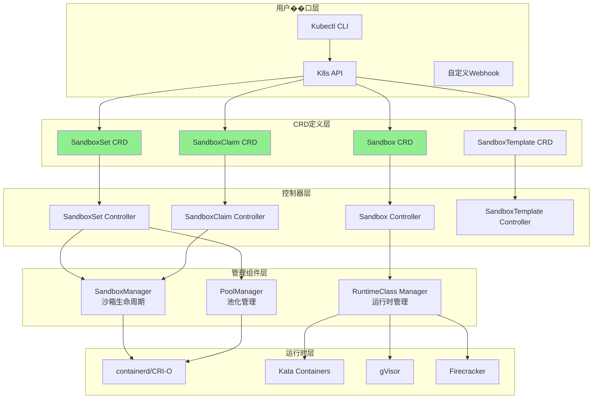

### D.2 核心CRD能力详解

#### D.2.1 SandboxSet CRD

**定义**: 管理预热沙箱池的CRD

**核心能力**:
```yaml
apiVersion: agents.kruise.io/v1alpha1
kind: SandboxSet
metadata:
  name: python-pool
spec:
  # 沙箱模板
  template:
    spec:
      runtimeClassName: kata
      containers:
      - name: python
        image: python:3.11-slim
        resources:
          limits:
            cpu: "1"
            memory: "2Gi"

  # 池化策略
  replicas: 10  # 预热10个沙箱

  # 预热策略
  preheatStrategy:
    type: Always  # 始终保持10个预热
    minAvailable: 5  # 最少5个可用

  # 生命周期策略
  lifecycle:
    ttlSeconds: 3600  # 1小时后自动回收
```

**关键特性**:
- **预热池管理**: 自动维护指定数量的预热沙箱
- **声明式扩缩**: 通过修改replicas自动扩缩池容量
- **生命周期管理**: 支持TTL,自动回收过期沙箱
- **多运行时支持**: 通过RuntimeClass支持多种运行时

#### D.2.2 SandboxClaim CRD

**定义**: 声明式申请沙箱的CRD

**核心能力**:
```yaml
apiVersion: agents.kruise.io/v1alpha1
kind: SandboxClaim
metadata:
  name: user-sandbox
spec:
  # 从哪个SandboxSet申请
  templateName: python-pool

  # 申请数量
  replicas: 1

  # 超时配置
  claimTimeout: 5m  # 5分钟内必须申请到

  # 环境变量注入
  envVars:
    API_KEY: "sk-xxx"
    DEBUG: "true"

  # 自动清理
  ttlAfterCompleted: 1h  # 完成后1小时自动删除
```

**申请流程**:
1. 用户创建SandboxClaim
2. Controller从SandboxSet池中分配沙箱
3. 注入环境变量
4. 沙箱就绪后通知用户
5. 使用完毕后自动清理Claim

#### D.2.3 Sandbox CRD

**定义**: 单个沙箱实例的CRD

**核心能力**:
```yaml
apiVersion: agents.kruise.io/v1alpha1
kind: Sandbox
metadata:
  name: sandbox-12345
spec:
  # 基础配置
  runtimeClassName: kata

  # 容器配置
  containers:
  - name: main
    image: python:3.11-slim
    env:
    - name: API_KEY
      value: "sk-xxx"

  # 生命周期配置
  shutdownTime: "2026-03-22T12:00:00Z"  # 定时关闭

  # 资源配置
  resources:
    limits:
      cpu: "1"
      memory: "2Gi"
```

**状态管理**:
```yaml
status:
  # 沙箱状态
  phase: Running  # Pending, Running, Succeeded, Failed

  # 网络信息
  podIP: "10.244.0.10"
  sandboxID: "sb-abc123"

  # 资源使用
  resourceUsage:
    cpu: "0.5"
    memory: "1.2Gi"

  # 健康状态
  conditions:
  - type: Ready
    status: "True"
    lastTransitionTime: "2026-03-22T10:00:00Z"
```

### D.3 关键技术实现原理

#### D.3.1 沙箱池化管理原理

**预热池架构**:

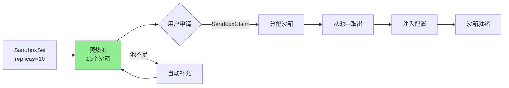

**实现原理**:
1. **池维护**:
   - SandboxSet Controller监控池容量
   - 当可用沙箱<minAvailable时,自动创建新沙箱
   - 当总沙箱>replicas时,自动回收多余沙箱

2. **分配机制**:
   - SandboxClaim Controller监听Claim请求
   - 从对应SandboxSet的池中选择沙箱
   - 通过annotation标记沙箱已分配
   - 移除SandboxSet的ownerReference,添加Claim的ownerReference

3. **环境变量注入**:
   - 通过envd init端点注入环境变量
   - 支持动态注入,无需重启沙箱

**关键代码示例**:
```go
// SandboxSet Controller
func (r *SandboxSetReconciler) reconcilePool(sandboxSet *SandboxSet) error {
    // 1. 获取当前池中的沙箱数量
    sandboxes := r.listSandboxes(sandboxSet)

    // 2. 计算需要补充的数量
    desired := sandboxSet.Spec.Replicas
    current := len(sandboxes.Available)

    if current < desired {
        // 3. 创建新沙箱补充池
        for i := 0; i < desired-current; i++ {
            r.createSandbox(sandboxSet)
        }
    }
}
```

#### D.3.2 沙箱生命周期管理原理

**生命周期状态机**:

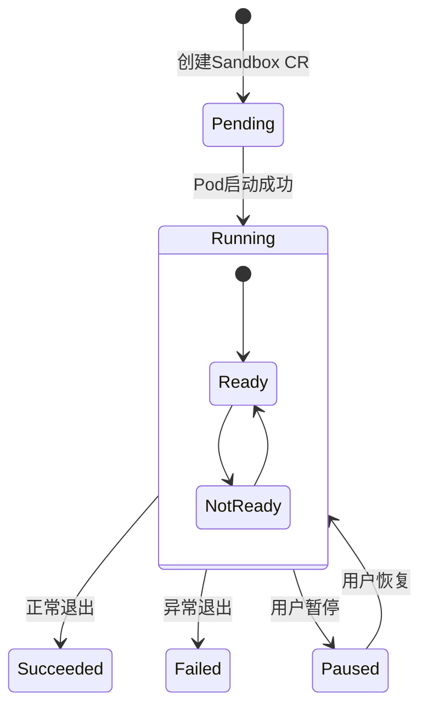

**关键实现**:
1. **状态同步**:
   - 监听对应的Pod状态
   - 同步Pod状态到Sandbox CR的status.phase
   - 处理Pod的异常情况

2. **Pause/Resume**:
   - Pause: 调用Pod的freeze接口
   - Resume: 调用Pod的unfreeze接口

3. **TTL管理**:
   - 监控Sandbox的创建时间
   - 超过TTL后自动删除Sandbox CR

**代码示例**:
```go
// Sandbox Controller
func (r *SandboxReconciler) reconcileLifecycle(sandbox *Sandbox) error {
    // 1. 获取对应的Pod
    pod := r.getPod(sandbox)

    // 2. 同步Pod状态
    sandbox.Status.Phase = SandboxPhase(pod.Status.Phase)
    sandbox.Status.PodIP = pod.Status.PodIP

    // 3. 检查TTL
    if time.Now().After(sandbox.CreationTimestamp.Add(sandbox.Spec.TTL)) {
        r.deleteSandbox(sandbox)
    }
}
```

#### D.3.3 声明式沙箱分配原理

**SandboxClaim Controller流程**:

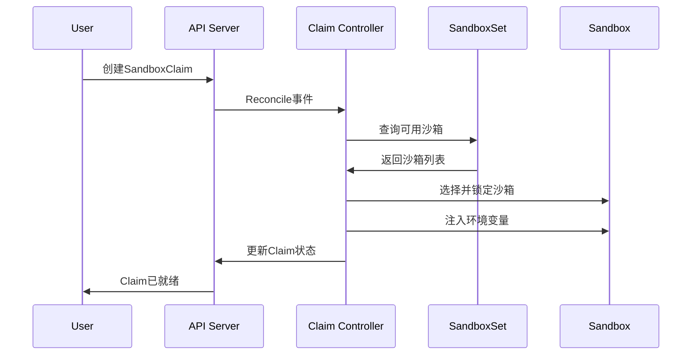

**实现原理**:
1. **乐观锁机制**:
   - 使用annotation作为锁
   - 通过resourceVersion实现乐观锁
   - 冲突时自动重试

2. **环境变量注入**:
   - 通过envd的/init端点
   - 支持key-value格式
   - 注入后沙箱可立即使用

3. **自动清理**:
   - ttlAfterCompleted超时后自动删除Claim
   - 不删除已分配的沙箱
   - 沙箱独立管理生命周期

**代码示例**:
```go
// SandboxClaim Controller
func (r *SandboxClaimReconciler) claimSandbox(claim *SandboxClaim) error {
    // 1. 从SandboxSet池中查找可用沙箱
    sandboxes := r.listAvailableSandboxes(claim.Spec.TemplateName)

    // 2. 选择并锁定沙箱
    sandbox := sandboxes[0]
    sandbox.Annotations["claim-lock"] = claim.Name

    // 3. 注入环境变量
    r.injectEnvVars(sandbox, claim.Spec.EnvVars)

    // 4. 更新Claim状态
    claim.Status.Phase = "Completed"
    claim.Status.ClaimedReplicas = 1
}
```

### D.4 扩展机制详解

#### D.4.1 RuntimeClass扩展

**支持多种运行时**:
```yaml
# kata-openeuler运行时
apiVersion: node.k8s.io/v1
kind: RuntimeClass
metadata:
  name: kata-openeuler
handler: kata
overhead:
  podFixed: "120Mi"
  podOverhead: "0.1"
---
# gvisor运行时
apiVersion: node.k8s.io/v1
kind: RuntimeClass
metadata:
  name: gvisor
handler: runsc
```

**运行时选择策略**:
- 根据安全级别选择: 高安全用kata,中安全用gVisor
- 根据性能需求选择: 高性能用runc,平衡用kata
- 根据资源限制选择: 资源充足用kata,资源紧张用gVisor

#### D.4.2 Controller扩展

**扩展点**:
- **Finalizer扩展**: 沙箱删除前的清理逻辑
- **Webhook扩展**: 沙箱创建时的验证逻辑
- **Status扩展**: 自定义状态字段

**示例: 硬件亲和扩展**:
```go
// 扩展SandboxClaim Spec
type SandboxClaimSpec struct {
    // ... 原有字段 ...

    // 硬件亲和配置 - 扩展
    HWAffinity *HWAffinityConfig `json:"hwAffinity,omitempty"`
}

type HWAffinityConfig struct {
    // NUMA亲和
    NUMAAffinity bool `json:"numaAffinity,omitempty"`

    // 内存合并
    EnableKSM bool `json:"enableKsm,omitempty"`

    // 节点选择
    NodeSelector map[string]string `json:"nodeSelector,omitempty"`
}
```

### D.5 生产级特性

#### D.5.1 多租户隔离

**实现机制**:
- **Namespace隔离**: 每个租户独立的Namespace
- **RBAC权限**: 通过RBAC控制租户访问权限
- **ResourceQuota**: 限制租户资源使用
- **NetworkPolicy**: 租户网络隔离

**配置示例**:
```yaml
# 租户Namespace
apiVersion: v1
kind: Namespace
metadata:
  name: tenant-a
  labels:
    tenant: tenant-a
---
# 租户ResourceQuota
apiVersion: v1
kind: ResourceQuota
metadata:
  name: tenant-a-quota
  namespace: tenant-a
spec:
  hard:
    requests.cpu: "10"
    requests.memory: "20Gi"
    count/sandboxes.agents.kruise.io: "50"
```

#### D.5.2 审计日志

**审计事件**:
- **沙箱创建**: 记录创建时间,用户,模板
- **沙箱分配**: 记录分配时间,Claim信息
- **沙箱删除**: 记录删除时间,原因
- **环境变量注入**: 记录注入的变量(脱敏)

**审计日志示例**:
```json
{
  "eventType": "SandboxClaimed",
  "timestamp": "2026-03-22T10:00:00Z",
  "sandbox": "sandbox-12345",
  "claim": "user-sandbox",
  "user": "user@example.com",
  "template": "python-pool",
  "envVars": ["API_KEY=***", "DEBUG=true"]
}
```

#### D.5.3 监控指标

**核心指标**:
- **池容量指标**:
  - `sandbox_pool_available_count{template="python-pool"}`: 可用沙箱数
  - `sandbox_pool_total_count{template="python-pool"}`: 总沙箱数
- **分配指标**:
  - `sandbox_claim_duration_seconds`: 分配延迟
  - `sandbox_claim_success_total`: 成功分配数
  - `sandbox_claim_failure_total`: 失败分配数
- **资源指标**:
  - `sandbox_cpu_usage_cores`: CPU使用量
  - `sandbox_memory_usage_bytes`: 内存使用量

**监控大盘**:
- 池容量趋势图
- 分配成功率趋势图
- 资源使用热力图
- 异常沙箱告警列表

---

**文档结束**

本技术架构方案提供了基于渐进增强架构的完整实施路径,通过openEuler/鲲鹏的硬件亲和能力,补齐OpenKruise相对E2B的核心差距,构建智能体沙箱场景的竞争力。

**下一步**: 评审并批准此架构方案,启动Phase 1实施。
